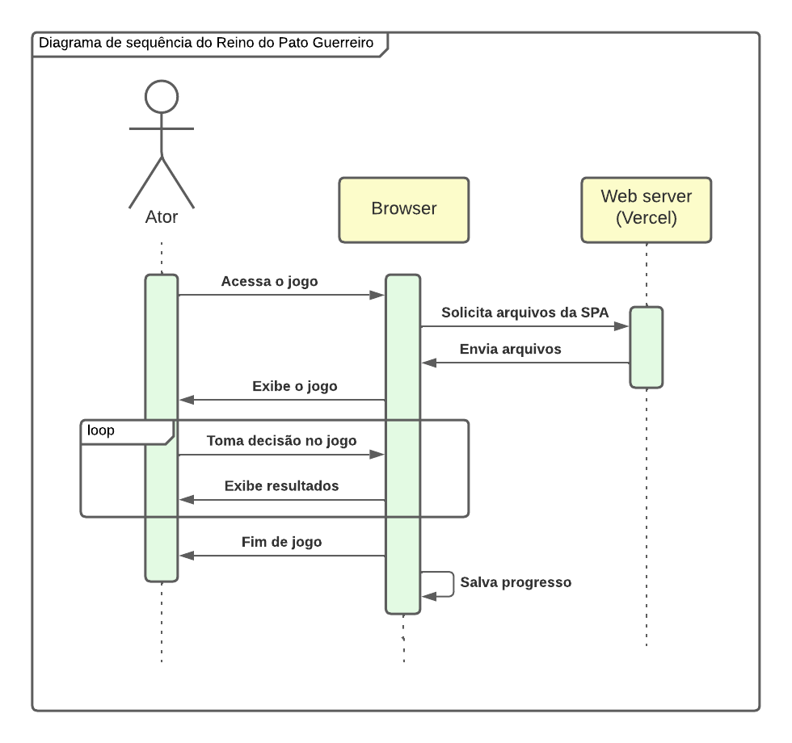

O projeto Reino do Pato Guerreiro será uma single page application (SPA), que deverá ser executada por um navegador web. Para a entrega de um MVP, a página referente à primeira versão do projeto dependerá apenas de recursos locais do dispositivo que a executa. Dessa forma, a necessidade de infraestrutura web por parte da equipe responsável pelo projeto se limita à entrega da página pelo protocolo HTTP, para que esta seja então executada localmente.

## 🏛️ Arquitetura local

### Framework

O sistema local será desenvolvido sobre o framework Angular, de forma a faicilitar o reuso de componentes que apareçam múltiplas vezes na interface, como, por exemplo, os itens do inventário. Além disso, o uso do Angular exigirá que a lógica seja implementada em TypeScript, cuja tipagem ocasionará maior segurança em algumas operações.

### Armazenamento persistente

Dados do progresso do personagem e da história deverão ser armazenados persistentemente, possibilitando que o jogador divida sua partida entre diferentes sessões. Conforme definido, a versão inicial do projeto não contará com armazenamento em nuvem, de forma que os dados de partida serão armazenados localmente no dispositivo do usuário.

## 💻 Arquitetura web

Conforme previamente descrito, a infraestrutura web para a primeira versão do projeto se limita à entrega dos arquivos estáticos da SPA que compõem o produto.

### Serverless

A página será entregue pelo serviço serverless de hospedagem Vercel, de forma que nenhuma infraestrutura é de responsabilidade da equipe de desenvolvimento.

## ➡️ Diagrama de sequência

